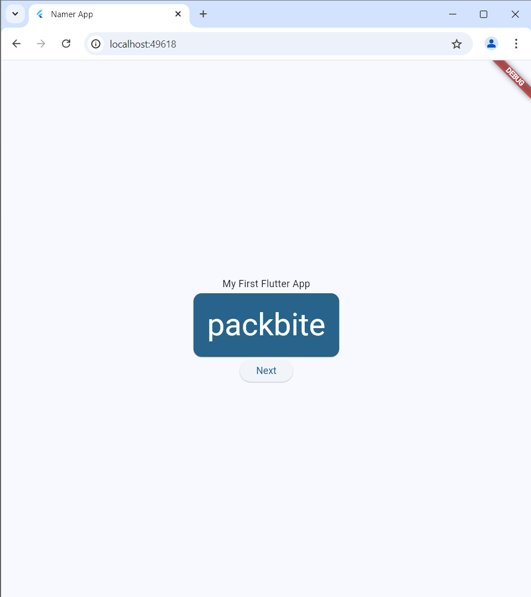
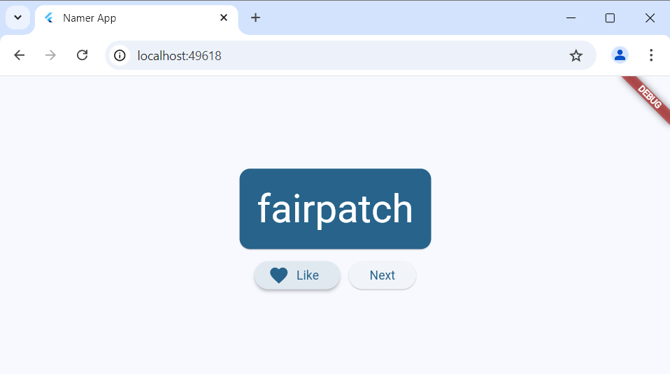
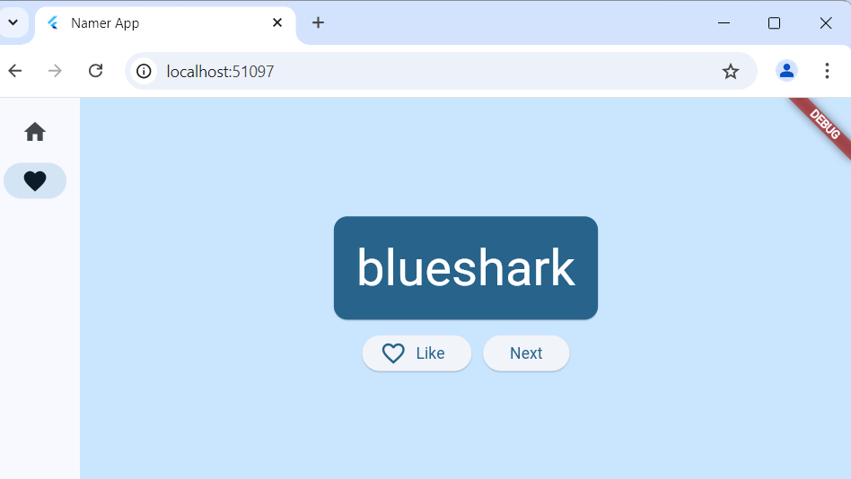

# Laporan Praktikum Pemrograman Mobile 
# Modul 5 : Tugas CodeLabs Your First Flutter App

## Nama     : Zaki Lazuardi Ferysa Putra
## Nim      : 2241720101
## Kelas    : TI-3B / 27

## 4. Add a button
### Launch the app
- Hasil

### Hot Reload
- Hasil

### Adding a button
- Hasil

## 5. Make the app prettier 
### Add a Card
- Hasil

### Theme and style
- Hasil

!

### TextTheme
- Hasil

### Center the UI
- Hasil

- Refactor

- Ubah MyHomePage

## 6. Add functionality
### Add the button
- Hasil

- Change

- Like Button

- Click Like Button

## 7. Add navigation rail
- Hasil

### SetState
- Click Button Favorite

### Use selectedIndex
- Hasil

### Responsiveness
- Hasil

## 8. Add a new page
- Favorites Page

- Like Card

- Hasil Setelah Klik Like

